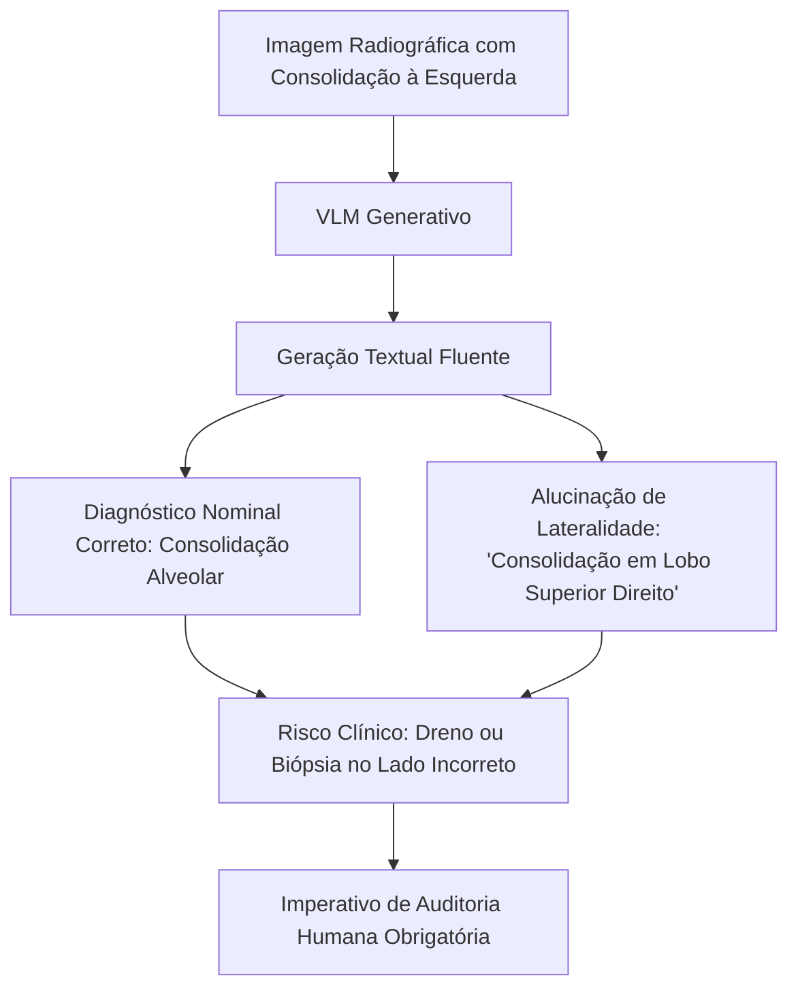

# Alucinações, Inconsistências e Erros Espaciais em VLMs

> [!warning] A Lacuna de Explicabilidade dos Modelos Generativos
> Enquanto modelos clássicos de redes neurais convolucionais (CNNs) oferecem mapas de calor espaciais diretos (ex: Grad-CAM), modelos generativos de visão-linguagem produzem narrativas textuais fluentes mas carecem de mecanismos nativos de ancoragem espacial visual (*grounding*). Isso dá origem ao **diagnóstico correto com atribuição espacial incorreta**.

---

## 1. Tipologia de Falhas Factual-Espaciais Documentadas

1. **Erro de Lateralidade (Inversão Anatômica):**
   - No estudo de triagem de tuberculose de **Hong 2025b**, a IA atingiu taxa de erro de lateralidade de **36,7%** (descrevendo cavitação ou infiltrado no pulmão direito quando a lesão real encontrava-se no hemitórax esquerdo).
2. **Alucinações Factual-Graves:**
   - No framework **ReXamine-Global (Banerjee et al. 2025)**, observou-se modelos gerando menções a:
     - Fraturas de arcos costais inexistentes;
     - Níveis hidroaéreos em radiografias normais;
     - Tubos orotraqueais e cateteres centrais em pacientes não invasivos.
3. **Imprecisão de Linguagem vs. Falso Positivo:**
   - Uso de termos diagnósticos definitivos ("pneumonia lobar confirmada") a partir de opacidades atelectásicas subsegmentares inespecíficas.

---

## 2. Estudos do Cofre Relacionados

- [[banerjee2025_rexamine|Banerjee et al. 2025]]: Framework ReXamine-Global para detecção de alucinações textuais em relatórios radiológicos.
- [[hong2025b_tuberculose|Hong 2025b]]: Triagem de tuberculose com medição formal de concordância anatômica (acurácia espacial de apenas 63,3%).
- [[kagiyama2026_prime2|Kagiyama et al. 2026]]: Diretrizes PRIME 2.0 para controle de alucinações e explicabilidade em IA multimodal cardiovascular e torácica.

---

## 3. Conexões

- Razão para obrigatoriedade de supervisão médica: [[Regulacao_ANVISA_SaMD]]
- Risco de aceitação acrítica por cansaço: [[Vies_de_Automacao_e_Workflow]]
