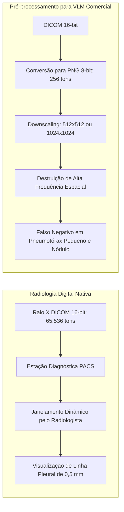

# O Gargalo de Compressão DICOM e Perda de Bits

> [!important] O Descompasso entre a Radiologia Médica e a IA Comercial
> A radiologia digital hospitalar opera sob o padrão **DICOM**, que codifica imagens com **12 a 16 bits de profundidade** ($4.096$ a $65.536$ níveis de cinza) e permite o janelamento interativo (*windowing*). Em contraste, a maioria dos codificadores visuais comerciais de VLMs aceita apenas entradas de **8 bits** (PNG ou JPEG com apenas $256$ níveis de cinza) e resoluções limitadas.

---

## 1. Comparativo Físico de Profundidade de Imagem

| Formato de Imagem | Níveis de Cinza | Resolução Típica | Detecção de Linha Pleural Fina | Identificação de Nódulo $<1$ cm |
| :--- | :---: | :---: | :---: | :---: |
| **DICOM Nativo (Hospital)** | **4.096 a 65.536** | $2048 \times 2048$ a $3072 \times 3072$ | **Excelente** (com janelamento dinâmico) | **Excelente** (alta frequência espacial) |
| **PNG / JPEG 8-bit (Web AI)** | **256** | $512 \times 512$ a $1024 \times 1024$ | **Prejudicada** (destruição do gradiente) | **Prejudicada** (artefato de suavização) |

---

## 2. Evidências nos Estudos Incluídos

- **Güzel 2026:** Descreve um pipeline explícito de conversão de DICOM para PNG de 8 bits em escala de cinza com compressão espacial. O modelo Gemini 2 Pro atingiu apenas 22% de sensibilidade em lesões pequenas.
- **Khovanova 2026:** Documentou sensibilidade de 31,6% para nódulos pulmonares usando Claude 3.7 Sonnet sob imagens convertidas.
- **Hong 2025a:** Operou diretamente com processamento interno DICOM e obteve 95,3% de sensibilidade no modelo KARA-CXR.

---

## 3. Conexões

- Impacto direto sobre: [[Pneumotorax_e_Lesoes_Agudas]]
- Diferenciação entre arquiteturas: [[Modelos_Dominio_Especificos]] vs [[Modelos_Proposito_Geral]]
