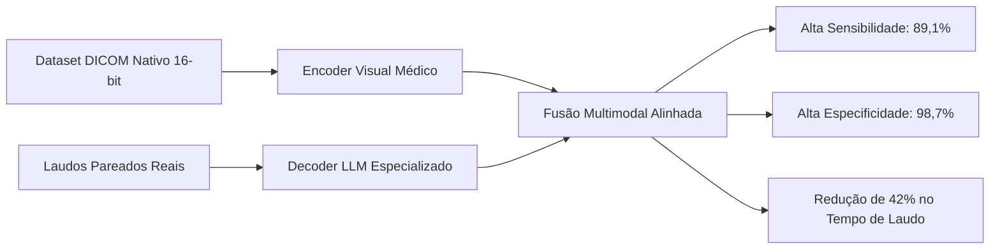

# Modelos Domínio-Específicos em Radiologia Torácica

> [!abstract] Definição Conceitual
> Modelos de visão-linguagem (VLMs) e geradores de laudos que foram pré-treinados, ajustados por fine-tuning ou alinhados utilizando coortes maciças de pares **imagem radiológica $\leftrightarrow$ laudo médico real**, como o KARA-CXR (Hong et al.), os modelos generativos de Stanford (Huang et al.), o CXR-LLaVA (Lee et al.) e o Janus-Pro-CXR (Bai et al.).

---

## 1. Desempenho Meta-Analítico Sintetizado

Na análise de sensibilidade e subgrupo bivariada hierárquica (Cenário I, $N=4$ estudos bivariados, $101.096$ exames radiográficos):

| Métrica Diagnóstica | Estimativa Agrupada (IC 95%) | Intervalo de Predição (95%) |
| :--- | :---: | :---: |
| **Sensibilidade** | **89,1%** (74,5% -- 95,8%) | 5,8% -- 99,9% |
| **Especificidade** | **98,7%** (80,8% -- 99,9%) | 0,0% -- 100,0% |
| **Razão de Verossimilhança Positiva (RV+)** | **67,39** | -- |
| **Razão de Verossimilhança Negativa (RV-)** | **0,111** | -- |
| **Área sob a Curva (AUC SROC)** | **0,959** | -- |

---

## 2. Estudos do Cofre Pertencentes a este Hub

- [[hong2025a_diagnostic|Hong 2025a]]: Detecção de Pneumotórax via KARA-CXR ($N=2.145$, Sens 95,3%, Spec 92,7%)
- [[hong2025b_tuberculose|Hong 2025b]]: Triagem Comunitária de Tuberculose ($N=800$, Sens 95,2%, Spec 86,7%)
- [[huang2023|Huang 2023]]: Geração de Laudos em Raio X de Emergência ($N=500$, Sens 84,8%, Spec 98,5%)
- [[huang2025|Huang 2025]]: Estudo Prospectivo Consecutivo de Triagem de Pneumotórax ($N=97.651$, Sens 72,7%, Spec 99,98%)
- [[lee2025|Lee 2025]]: Avaliação Multicêntrica de CXR-LLaVA ($N=3.689$, Síntese Narrativa)
- [[bai2026|Bai 2026]]: Ensaio Prospectivo Multicêntrico com Janus-Pro-CXR (*Nature Communications*, $N=296$)

---

## 3. Relações com Outros Conceitos

- Contraste direto com: [[Modelos_Proposito_Geral]]
- Preservação da profundidade de imagem: [[Gargalo_DICOM_e_Compressao_8bit]]
- Ganhos de fluxo e risco de habituação: [[Vies_de_Automacao_e_Workflow]]
