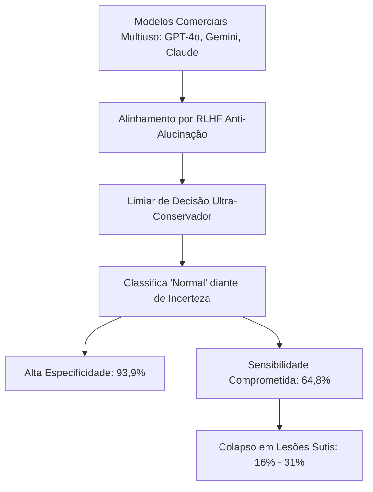

# Modelos de Propósito Geral em Radiologia Torácica

> [!warning] Caracterização e Desempenho
> Modelos comerciais de grande escala multiúso (ex: GPT-4o, GPT-5.1, Gemini 2 Pro, Claude 3.7 Sonnet) avaliados diretamente em tarefas radiológicas com prompts zero-shot ou few-shot, sem adaptação prévia específica de pesos para imagens médicas.

---

## 1. Desempenho Meta-Analítico Sintetizado

Na análise de subgrupo bivariada hierárquica (Cenário J, $N=5$ estudos bivariados, $12.618$ exames radiográficos):

| Métrica Diagnóstica | Estimativa Agrupada (IC 95%) | Intervalo de Predição (95%) |
| :--- | :---: | :---: |
| **Sensibilidade** | **64,8%** (27,3% -- 90,1%) | 0,4% -- 99,9% |
| **Especificidade** | **93,9%** (92,6% -- 94,9%) | 88,4% -- 96,9% |
| **Razão de Verossimilhança Positiva (RV+)** | **10,60** | -- |
| **Razão de Verossimilhança Negativa (RV-)** | **0,375** | -- |
| **Área sob a Curva (AUC SROC)** | **0,941** | -- |

---

## 2. Estudos do Cofre Pertencentes a este Hub

- [[akcay2026|Akçay & Öztürk 2025]]: Avaliação do GPT-4o em pneumotórax ($N=220$, Sens 70,9%, Spec 96,4%; colapso para lesões $<2$ cm)
- [[ciflik2026|Ciflik et al. 2026]]: Avaliação do ChatGPT em pronto-socorro ($N=240$, Sens 100%, Spec 91,4%)
- [[guzel2026|Güzel et al. 2026]]: Avaliação em larga escala de Gemini 2 Pro e Claude no dataset SIIM-ACR ($N=10.675$, Sens 22,0%, Spec 95,0%)
- [[khovanova2025|Khovanova et al. 2026]]: Claude 3.7 Sonnet em nódulos pulmonares ($N=83$, Sens 31,6%, Spec 93,3%)
- [[ostrovsky2025|Ostrovsky 2025]]: ChatGPT-4.0 em subtarefas clínicas do NIH ChestX-ray ($N=1.400$, Sens 76,2%, Spec 93,7%)
- [[bulut2025|Bulut et al. 2025]]: Coorte exclusivamente positiva para pneumotórax ($N=172$, Sens 100% em grandes vs 38,2% em pequenas)

---

## 3. Relações com Outros Conceitos

- Contraste direto com: [[Modelos_Dominio_Especificos]]
- Causa de falha em nódulos e pneumotórax: [[Pneumotorax_e_Lesoes_Agudas]]
- Compressão e conversão de entrada: [[Gargalo_DICOM_e_Compressao_8bit]]
- Limitação legal para autonomia: [[Regulacao_ANVISA_SaMD]]
