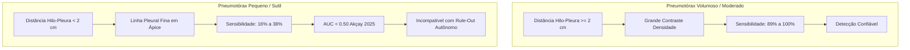

# Pneumotórax e Detecção de Lesões Agudas

> [!danger] O Desafio da Linha Pleural e Lesões Sutis
> O pneumotórax é a condição clínica com o maior número de estudos primários incluídos na meta-análise ($N=5$ bivariados e $N=1$ suplementar). Os resultados revelam uma dicotomia diagnóstica crítica: excelente detecção para colapsos pulmonares volumosos/hipertensivos, mas falhas substanciais diante de pequenas lâminas apicais.

---

## 1. Síntese do Subgrupo de Pneumotórax ($N=5$, $110.931$ exames)

- **Sensibilidade Agrupada:** **79,0%** (IC 95%: 40,0% -- 95,5%)
- **Especificidade Agrupada:** **98,0%** (IC 95%: 83,8% -- 99,8%)
- **Razão de Verossimilhança Positiva (RV+):** **38,87**
- **Razão de Verossimilhança Negativa (RV-):** **0,214**
- **Área sob a Curva (AUC SROC):** **0,962**

---

## 2. O Fenômeno do "Colapso em Lesões Pequenas"

---

## 3. Estudos Associados

- [[akcay2026|Akçay 2025]]: Demonstrou AUC de 0,894 para lesões $\ge 2$ cm contra AUC de 0,439 para lesões $<2$ cm.
- [[guzel2026|Güzel 2026]]: Identificou sensibilidade média de 22% para pneumotórax discreto no SIIM-ACR.
- [[bulut2025|Bulut 2025]]: Sensibilidade de 100% em grandes vs. 38,2% em pequenas lâminas.
- [[hong2025a_diagnostic|Hong 2025a]]: O modelo dedicado KARA-CXR atingiu 95,3% de sensibilidade operando em DICOM nativo.
- [[huang2025|Huang 2025]]: Sistema prospectivo de priorização de pneumotórax crítico ($N=97.651$).

---

## 4. Conexões

- Fator físico determinante: [[Gargalo_DICOM_e_Compressao_8bit]]
- Proibição regulatória de triagem isolada: [[Regulacao_ANVISA_SaMD]]
