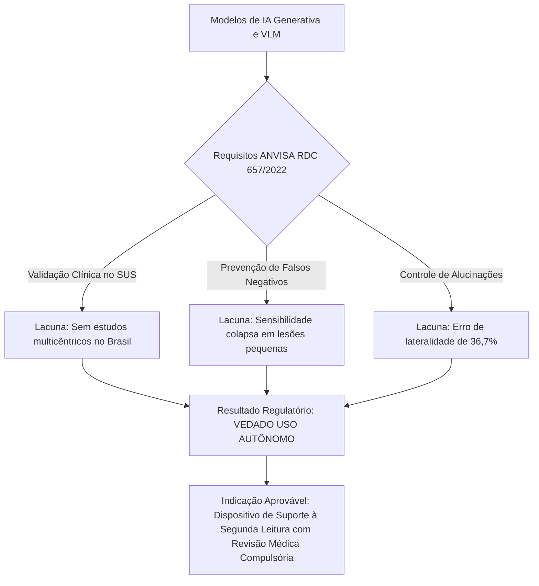

# Regulação Sanitária e Governança de IA Médica no Brasil

> [!abstract] Enquadramento Regulatório (RDC 657/2022 ANVISA)
> No Brasil, sistemas de inteligência artificial voltados ao auxílio diagnóstico ou triagem radiológica são classificados como **Software como Dispositivo Médico (SaMD - *Software as a Medical Device*)** sob regulação da Agência Nacional de Vigilância Sanitária (ANVISA).

---

## 1. Diretrizes Normativas Principais

- **RDC nº 657/2022 da ANVISA:** Define as regras para regularização de software como dispositivo médico.
- **Classe de Risco:** Ferramentas de suporte à decisão clínica para triagem de condições emergenciais (ex: pneumotórax hipertensivo) enquadram-se nas classes de risco intermediário a alto (Classe II ou III).
- **Validação Clínica Nacional:** Exige evidências clínicas retrospectivas e prospectivas de desempenho e segurança em populações que representem o perfil epidemiológico do país (ex: dados do Sistema Único de Saúde - SUS).

---

## 2. Status Científico dos Modelos Generativos perante a ANVISA

---

## 3. Conexões

- Comprovação do colapso em lesões sutis: [[Pneumotorax_e_Lesoes_Agudas]]
- Necessidade de conferência espacial: [[Alucinacoes_e_Erro_Espacial]]
- Prevenção do viés passivo: [[Vies_de_Automacao_e_Workflow]]
