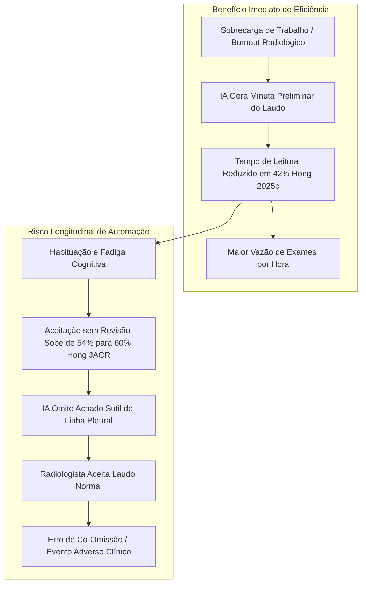

# Viés de Automação, Fadiga Cognitiva e Eficiência de Fluxo

> [!important] O Paradoxo da Eficiência Radiológica
> A assistência por IA generativa comprovadamente acelera a emissão de laudos preliminares (redução de até 42% no tempo de digitação). No entanto, em rotinas de alta sobrecarga de trabalho, essa velocidade induz à habituação progressiva e à aceitação passiva dos laudos da máquina, expondo o processo ao fenômeno da **co-omissão**.

---

## 1. O Trade-off Eficiência vs. Risco de Co-omissão

---

## 2. Evidências Empíricas nos Estudos Incluídos

1. **Hong et al. (Radiology 2025) — Reader Study:**
   - Amostra: $758$ radiografias avaliadas por 5 radiologistas.
   - O tempo de laudo caiu de **34,2 s** para **19,8 s** por exame (redução de **42%**, $P < 0,001$).
   - A sensibilidade para lesões pleurais subiu de 77,7% para 87,4%.
2. **Hong et al. (JACR 2026) — Estudo Longitudinal de Interação:**
   - 5 radiologistas avaliando 756 radiografias em 7 lotes sequenciais ao longo de um mês.
   - A taxa de aceitação passiva do laudo da IA sem nenhuma edição subiu progressivamente de **54,6%** para **60,2%** ($P < 0,001$).
   - Conclusão: a habituação diminui o escrutínio independente nos casos patológicos complexos.

---

## 3. Salvaguarda de Fluxo Recomendada

Para mitigar a co-omissão, o protocolo de fluxo hospitalar deve implementar uma barreira de interface: **leitura visual humana independente obrigatória antes da exibição da sugestão textual da IA**.

---

## 4. Conexões

- Fator anatômico que é co-omitido: [[Pneumotorax_e_Lesoes_Agudas]]
- Impacto da perda de bits: [[Gargalo_DICOM_e_Compressao_8bit]]
- Regulamentação e responsabilidade jurídica: [[Regulacao_ANVISA_SaMD]]
